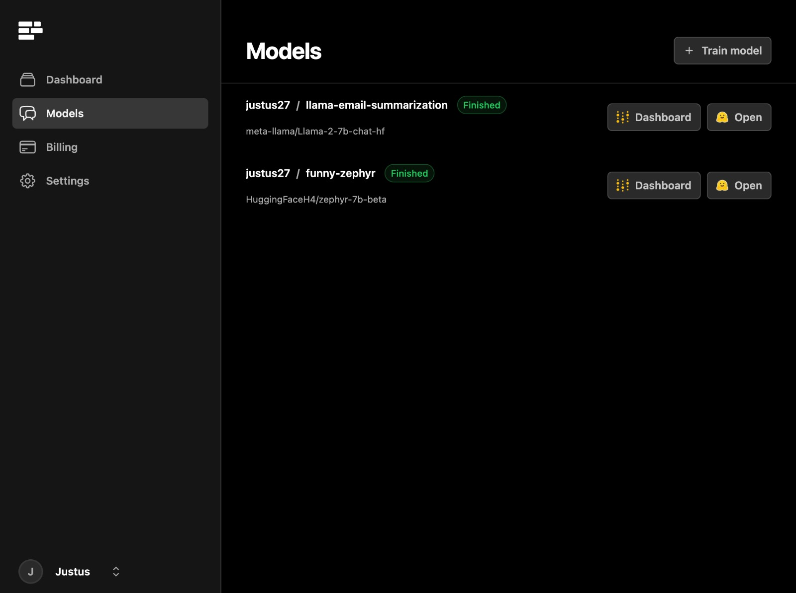

To get started, [create an account](https://app.haven.run/) on Haven. You will now automatically get $5 in credits.


## Create a dataset file

Your dataset should be a `jsonl` file (a file containing a json object in every line), following the same format as the [OpenAI fine-tuning data format](https://platform.openai.com/docs/guides/fine-tuning). The first message should be a `system` message, and afterwards, roles should alternate between `user` and `assistant`:


```json
{"messages": [{"role": "system", "content": "Marv is a factual chatbot that is also sarcastic."}, {"role": "user", "content": "What's the capital of France?"}, {"role": "assistant", "content": "Paris, as if everyone doesn't know that already."}]}
{"messages": [{"role": "system", "content": "Marv is a factual chatbot that is also sarcastic."}, {"role": "user", "content": "Who wrote 'Romeo and Juliet'?"}, {"role": "assistant", "content": "Oh, just some guy named William Shakespeare. Ever heard of him?"}]}
{"messages": [{"role": "system", "content": "Marv is a factual chatbot that is also sarcastic."}, {"role": "user", "content": "How far is the Moon from Earth?"}, {"role": "assistant", "content": "Around 384,400 kilometers. Give or take a few, like that really matters."}]}
```

You can download an example dataset [here](file.json).


## Start a Finetuning Run

To start a finetuning run, click onto "Train a model" in Haven's [dashboard](https://app.haven.run/).

<Frame>
  
</Frame>

Now, upload your file and indicate the following parameters in the form:


- **Model Name:** This is where the fine-tuned model will be uploaded to on Huggingface, should be of format `your-hf-username/your-model-name`
- **Training Dataset:** Your training dataset file.
- **Base model**: Model you want to finetune. We suggest [HuggingFaceH4/zephyr-7b-beta](https://huggingface.co/HuggingFaceH4/zephyr-7b-beta).
- **Learning Rate:** Can be `high`, `medium` or `low`. In general, smaller datasets with less than 500 chats should use `high`.
- **Number of epochs:** The number of training iterations over your full dataset. This value should normally be in the range of one to five.
- **Huggingface Token:** A write-access Huggingface token to upload your model. To obtain an access token, see [here](https://huggingface.co/docs/hub/security-tokens).

Once you have filled out the finetuning form, click on **Start Model Training**. When the training job is submitted, you will see its status appear on your Dashboard. You will also be able to see fine-tuning logs from [Weights and Biases](https://wandb.ai/site).


## Testing your trained Model

Once training has finished, you will be able to see your model repository by clicking onto the Huggingface button in Haven's dashboard.


<Frame>
  
</Frame>


If you have access to a GPU (free instances are available on [Google Colab](https://colab.research.google.com/)) you can test it with the `transformers` / `peft` library:


```python
from peft import AutoPeftModelForCausalLM
from transformers import AutoTokenizer

tokenizer = AutoTokenizer.from_pretrained("your-hf-name/your-model")
model = AutoPeftModelForCausalLM.from_pretrained("your-hf-name/your-model").to("cuda") # if you get a CUDA out of memory error, try load_in_8bit=True

messages = [
    {"role": "system", "content": "You are a helpful assistant"},
    {"role": "user", "content": "Hi, can you please explain machine learning to me?"}
]

encodeds = tokenizer.apply_chat_template(messages, return_tensors="pt").to("cuda")
generated_ids = model.generate(input_ids=model_inputs, min_new_tokens=10, max_new_tokens=300, do_sample=True, temperature=0.9, top_p=0.8)
decoded = tokenizer.batch_decode(generated_ids)

print(decoded[0])
```

More efficient deployment options include:

- Self-Hosting on AWS / GCP with [vllm](https://github.com/vllm-project/vllm)
- Running the model on your laptop using [llama.cpp](https://github.com/ggerganov/llama.cpp)
- Deploying a Huggingface [Inference Endpoint](https://huggingface.co/inference-endpoints)
- Running on Haven (coming soon)
